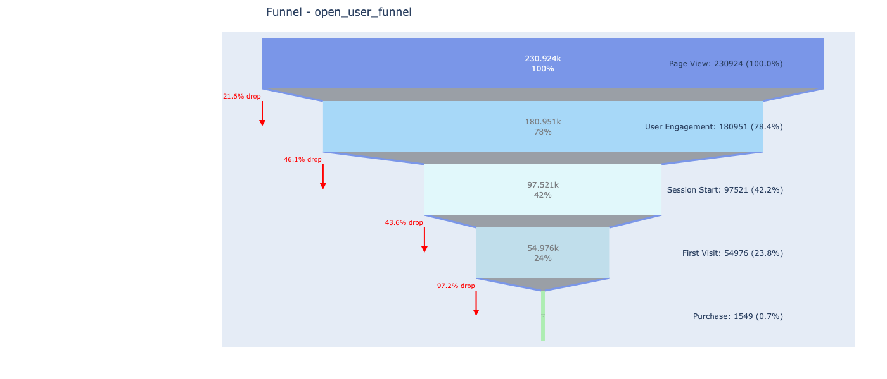
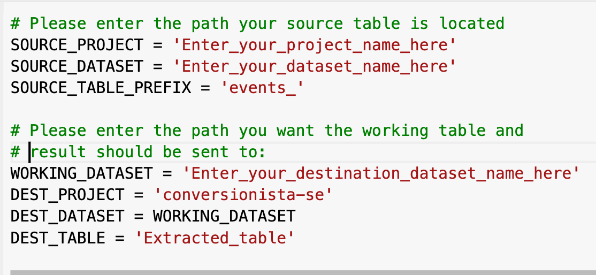

# BigQuery Funnel Analysis Tool

## Introduction

In the world of digital marketing and e-commerce, understanding user behavior is crucial. Conversion reviews and funnel analyses are powerful tools that help businesses track and optimize the customer journey. This BigQuery Funnel Analysis Tool brings a new level of sophistication to these processes.

Our tool leverages the power of Google BigQuery to process large volumes of event data, creating detailed and customizable funnel analyses. It allows marketers and analysts to:

- Visualize user journeys across multiple touchpoints
- Identify drop-off points in the conversion process
- Compare different user segments and time periods
- Generate both open and closed funnel analyses for users and sessions

What sets this tool apart is its flexibility and scalability. It can handle massive datasets, work with custom event definitions, and produce interactive visualizations, all within the familiar Jupyter notebook environment.

## How to Run and Use the Notebook

### Setup

1. Ensure you have access to Google BigQuery and the necessary permissions.
2. Install required Python libraries:
        pip install google-cloud-bigquery pandas plotly ipywidgets
### Configuration

1. Set up your BigQuery project, dataset, and table information in the notebook.
2. Configure the destination for your analysis results.

### Running the Analysis

1. Execute the notebook cells in order.

2. You'll be prompted to select a date range for your analysis.
3. Choose the events you want to include in your funnel.
4. Select any additional dimensions and/or filter for segmentation.
5. The tool will generate and display interactive funnel visualizations.

## Data Tables Generated

The tool generates four main types of funnel tables in BigQuery:

1. **Open User Funnel**: Tracks unique users through each step of the funnel, regardless of order.
2. **Open Session Funnel**: Similar to the open user funnel, but tracks unique sessions.
3. **Close User Funnel**: Tracks users who complete funnel steps in a specific order.
4. **Close Session Funnel**: Tracks sessions where funnel steps are completed in order.

Each table includes:
- Event counts for each funnel step
- Conversion rates between steps
- Additional selected dimensions for segmentation

## What's Not Included

- Data collection: This tool assumes you already have event data in BigQuery.
- Advanced statistical analysis: While the tool provides conversion rates, it doesn't include more complex statistical tests or predictive models.
- Automatic insights generation: The tool visualizes data but doesn't automatically identify anomalies or suggest optimizations.

## Future Work

There is exciting opportunities to enhance this tool further:

1. **Machine Learning Integration**: Implement predictive models to forecast conversion rates and identify at-risk segments.
2. **A/B Test Analysis**: Add functionality to compare funnels between different test groups.
3. **Automated Reporting**: Develop a system for scheduled funnel analysis and report generation.
4. **Multi-Channel Funnels**: Extend the tool to analyze user journeys across different marketing channels.
5. **Custom Visualization Themes**: Allow users to customize the look and feel of funnel visualizations.

## Troubleshooting

If you encounter any issues while using the tool, please check the following:

1. Ensure your BigQuery credentials are correctly set up.
2. Verify that your source data is in the expected format.
3. Check that you have the necessary permissions to create and query tables in your BigQuery project.

## Contact

For any questions or support, please contact [siwenli0615@gmail.com](mailto:siwenli0615@gmail.com).

## License

This project is licensed under the MIT License - see the [LICENSE.md](LICENSE.md) file for details.
