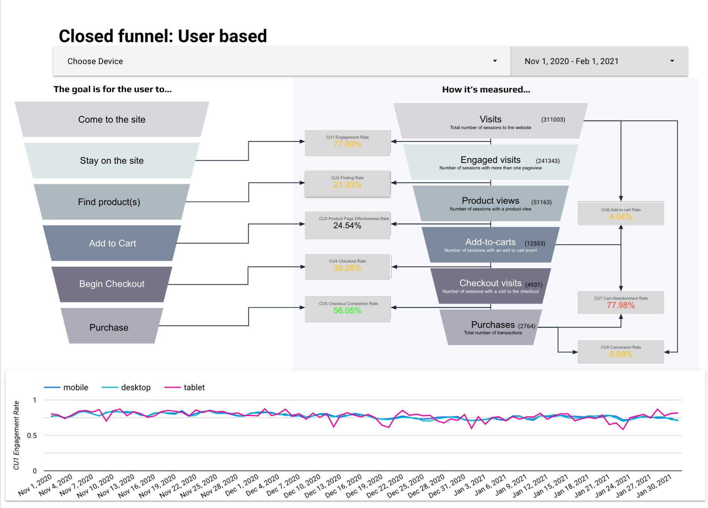
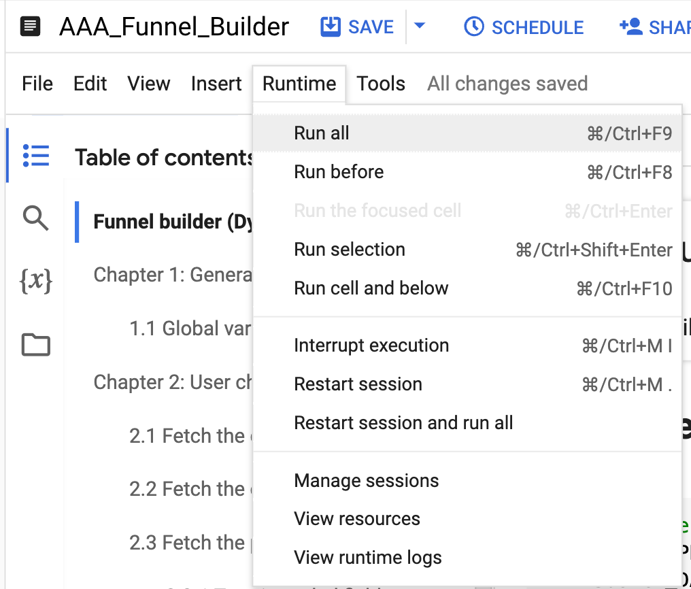

# BigQuery Funnel Analysis Tool

## Introduction

In the world of digital marketing and e-commerce, understanding user behavior is crucial. Conversion reviews and funnel analyses are powerful tools that help businesses track and optimize the customer journey. This BigQuery Funnel Analysis Tool brings a new level of sophistication to these processes.

Our tool leverages the power of Google BigQuery to process large volumes of event data, creating detailed and customizable funnel analyses. It allows marketers and analysts to:

- Visualize user journeys across multiple touchpoints
- Identify drop-off points in the conversion process
- Compare different user segments and time periods
- Generate both open and closed funnel analyses for users and sessions




What sets this tool apart is its flexibility and scalability. It can handle massive datasets, work with custom event definitions, and produce interactive visualizations, all within the familiar Jupyter notebook environment.

## How to Run and Use the Notebook

### Setup

1. Ensure you have access to Google BigQuery and the necessary permissions.
2. This tool has been developed and tested in the Google Cloud Vertex AI Workbench (formerly AI Platform Notebooks) environment. If you're using a different environment:
   - You may need to install required Python libraries:
     ```
     pip install google-cloud-bigquery pandas plotly ipywidgets
     ```
   - Some features may require additional setup or modification.

### Note on Development Environment

- The code has been primarily tested in the Google Cloud Vertex AI Workbench environment.
- If you're using a different notebook environment (e.g., local Jupyter notebook, Colab), you might encounter compatibility issues or need to make adjustments to the code.
- In non-Google Cloud environments, you'll need to set up authentication for BigQuery access manually.

### Configuration

1. Set up your BigQuery project, dataset, and table information in the notebook.
2. Configure the destination for your analysis results.


### Running the Analysis

1. Execute the notebook cells in order.


2. You'll be prompted to select a date range for your analysis.
3. Choose the events you want to include in your funnel.
4. Select any additional dimensions and/or filter for segmentation.
5. The tool will generate and display interactive funnel visualizations.

## Data Tables Generated

The tool generates four main types of funnel tables in BigQuery:

1. **Open User Funnel**: Tracks unique users through each step of the funnel, regardless of order.
2. **Open Session Funnel**: Similar to the open user funnel, but tracks unique sessions.
3. **Close User Funnel**: Tracks users who complete funnel steps in a specific order.
4. **Close Session Funnel**: Tracks sessions where funnel steps are completed in order.

Each table includes:
- Event counts for each funnel step
- Conversion rates between steps
- Additional selected dimensions for segmentation
## Query Foundations

The funnel query codes in this tool are developed based on the methodology outlined in the following document:

[Google Analytics 4 (GA4) BigQuery Funnel Analysis](https://docs.google.com/document/d/157XXSaSLQ0wCuoC_TJiZfexqlngE0I7AopnTMY_CD4c/edit?tab=t.0)

This document serves as the foundation for our query logic and structure. If you notice any discrepancies in the results or need to troubleshoot the funnel analysis, we recommend:

1. Reviewing this document to understand the underlying logic of GA4 funnel analysis in BigQuery.
2. Comparing our implemented queries with the examples provided in the document.
3. Using the queries in the document as a baseline to verify or correct the results.

For developers working on maintaining or extending this tool:
- If you encounter issues with the funnel analysis results, consider rebuilding the queries using this document as a foundation.
- Any modifications to the core funnel logic should be cross-referenced with this document to ensure consistency with GA4 best practices.

This reference is crucial for ensuring the accuracy and reliability of the funnel analysis results. Always refer back to this document when making significant changes to the query structure or when troubleshooting unexpected results.

## What's Not Included

- Data collection: This tool assumes you already have event data in BigQuery.
- Advanced statistical analysis: While the tool provides conversion rates, it doesn't include more complex statistical tests or predictive models.
- Automatic insights generation: The tool visualizes data but doesn't automatically identify anomalies or suggest optimizations.
- The data for dashboard from Looker studio needs to be sent to Siwens_NoN and FUNNEL_TYPE = 'Dashboard'

## Future Work

There is exciting opportunities to enhance this tool further:

1. **Machine Learning Integration**: Implement predictive models to forecast conversion rates and identify at-risk segments.
2. **A/B Test Analysis**: Add functionality to compare funnels between different test groups.
3. **Automated Reporting**: Develop a system for scheduled funnel analysis and report generation.
4. **Multi-Channel Funnels**: Extend the tool to analyze user journeys across different marketing channels.
5. **Custom Visualization Themes**: Allow users to customize the look and feel of funnel visualizations.


## Troubleshooting

If you encounter any issues while using the tool, please check the following:

1. Ensure your BigQuery credentials are correctly set up.
2. Verify that your source data is in the expected format.
3. Check that you have the necessary permissions to create and query tables in your BigQuery project.


## Limitations and Undeveloped Features (To future developers)

While this tool provides powerful funnel analysis capabilities, there are some limitations and features that are not yet fully developed:

1. **Source Data Partitioning**: 
   - The tool currently assumes that the source data is partitioned by date. 
   - Each partition should be named in the format `events_YYYYMMDD`.
   - Users with non-partitioned data or different partitioning schemes may need to modify the code or preprocess their data.

2. **Handling of TYPE3 Nested Fields**:
   - The tool has limited support for complex nested fields, particularly TYPE3 nested fields like "items".
   - These fields often have a variable structure, where the nested fields are not fixed.
   - For example, the "items" field might contain different subfields for different types of items.
   - Current implementation may not correctly handle or allow full exploration of these complex nested structures.

3. **Dynamic Schema Adaptation**:
   - The tool doesn't automatically adapt to changes in the data schema, particularly for nested fields.
   - If the structure of nested fields changes, manual updates to the code may be required.

4. **Advanced Nested Field Querying**:
   - Complex queries involving nested fields, especially arrays of structs, are not fully supported.
   - Users may need to manually modify queries for advanced analysis of nested data.

5. **UI for Nested Field Selection**:
   - The user interface for selecting and filtering on nested fields is not fully developed.
   - This limits the ease of use when working with complex data structures.

Future development should focus on enhancing these areas to provide more robust and flexible analysis capabilities, particularly for complex e-commerce data with variable nested structures.

## Contact

For any questions or support, please contact [siwenli0615@gmail.com](mailto:siwenli0615@gmail.com).

## License

This project is licensed under the MIT License - see the [LICENSE.md](LICENSE.md) file for details.

